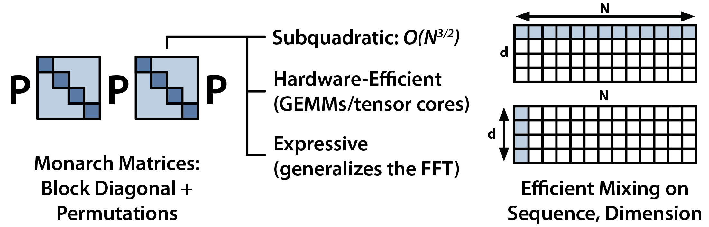

# Monarch Mixer

<!--  -->

**Update January 11, 2024:** We are excited to release new long-context M2-BERT models, with versions fine-tuned for embeddings! See the [blog post](https://hazyresearch.stanford.edu/blog/2024-01-11-m2-bert-retrieval) for more details, and check out [bert/EMBEDDINGS.md](bert/EMBEDDINGS.md) for more details!

<p align="center">
  
</p>

**Monarch Mixer: A Simple Sub-Quadratic GEMM-Based Architecture**\
Daniel Y. Fu, Simran Arora*, Jessica Grogan*, Isys Johnson*, Sabri Eyuboglu*, Armin W. Thomas*, Benjamin F. Spector, Michael Poli, Atri Rudra, and Christopher Ré.\
[arXiv](https://arxiv.org/abs/2310.12109) | [M2-BERT blog post](https://hazyresearch.stanford.edu/blog/2023-07-25-m2-bert)

**Long-Context Retrieval Models with Monarch Mixer**\
Jon Saad-Falcon, Dan Fu, Simran Arora. Blog post, Jan 11 2024.\
[Blog post](https://hazyresearch.stanford.edu/blog/2024-01-11-m2-bert-retrieval).

**Updates**:
* **January 11, 2024:** M2-BERT retrieval models are now available on Together API! Check out instructions [below](#getting-started-with-embeddings) for running them!
* **January 11, 2024:** New long-context M2-BERT models available (2k, 8k, and 32k), as well as retrieval versions for embeddings. Also releasing a preview of LoCo, a new benchmark for long-context retrieval! Check out our [blog](https://hazyresearch.stanford.edu/blog/2024-01-11-m2-bert-retrieval) to read more, and try the models out [here](bert/EMBEDDINGS.md)!
* **October 21, 2023:** M2-BERT-large checkpoints are now up on HuggingFace ([260M](https://huggingface.co/danfu09/m2-bert-260m), [341M](https://huggingface.co/danfu09/m2-bert-341m)). The 260M model matches BERT-large in GLUE fine-tuning with 24% fewer parameters, and the 341M model outperforms BERT-large.
* **October 18, 2023:** M2 paper is now up on arXiv, and will be presented at NeurIPS as an oral! 

**Base M2-BERT Checkpoints:**
* [M2-BERT-base (80M)](https://huggingface.co/danfu09/m2-bert-80M)
* [M2-BERT-base (110M)](https://huggingface.co/danfu09/m2-bert-110M)
* [M2-BERT-large (260M)](https://huggingface.co/danfu09/m2-bert-260m)
* [M2-BERT-large (341M)](https://huggingface.co/danfu09/m2-bert-341m)

**Long-Context and Retrieval M2-BERT Checkpoints:**
* [M2-BERT-base-80M-2K](https://huggingface.co/togethercomputer/m2-bert-80M-2k-retrieval)
* [M2-BERT-base-80M-8K](https://huggingface.co/togethercomputer/m2-bert-80M-8k-retrieval)
* [M2-BERT-base-80M-32K](https://huggingface.co/togethercomputer/m2-bert-80M-32k-retrieval)
* [M2-BERT-base-80M-2K-retrieval](https://huggingface.co/togethercomputer/m2-bert-80M-2k-retrieval)
* [M2-BERT-base-80M-8K-retrieval](https://huggingface.co/togethercomputer/m2-bert-80M-8k-retrieval)
* [M2-BERT-base-80M-32K-retrieval](https://huggingface.co/togethercomputer/m2-bert-80M-32k-retrieval)

Transformers have taken the world by a storm! The architecture is composed of two core operations: Attention for mixing information across the input sequence and MLPs for mixing information across the model dimension. Each operator scales quadratically -- the complexity of Attention is quadratic in sequence length and the complexity of an MLP is quadratic in model dimension. Ideally, we can have alternatives that scale more efficiently, while preserving Transformer-level quality. Towards this goal, we've been developing Monarch Mixer (M2), a framework for training models that are sub-quadratic in **both** sequence length and model dimension. 



Our basic idea is to replace the major elements of a Transformer with Monarch matrices — which are a class of structured matrices that generalize the FFT and are sub-quadratic, hardware-efficient, and expressive. In Monarch Mixer, we use layers built up from Monarch matrices to do both mixing across the sequence (replacing the Attention operation) and mixing across the model dimension (replacing the dense MLP). This repo includes code and models for training Monarch Mixer architectures!

### Getting Started with Embeddings

M2-BERT embedding models are now available on the Together API.
You can run them by signing up for an account and querying the API as follows (you can find your API key [here](https://api.together.xyz/settings/api-keys)):

```Python
import os
import requests

def generate_together_embeddings(text: str, model_api_string: str, api_key: str):
    url = "https://api.together.xyz/api/v1/embeddings"
    headers = {
        "accept": "application/json",
        "content-type": "application/json",
        "Authorization": f"Bearer {api_key}"
    }
    session = requests.Session()
    response = session.post(
        url,
        headers=headers,
        json={
            "input": text,
            "model": model_api_string
        }
    )
    if response.status_code != 200:
        raise ValueError(f"Request failed with status code {response.status_code}: {response.text}")
    return response.json()['data'][0]['embedding']

print(generate_together_embeddings('Hello world', 'togethercomputer/m2-bert-80M-32k-retrieval', os.environ['TOGETHER_API_KEY'])[:10])
```

Check out [bert/EMBEDDINGS.md](bert/EMBEDDINGS.md) for more on how to evaluate these models and run them locally!

### Current Contents

**January 9, 2024:** long-context M2-BERT-base checkpoints are up on HuggingFace, as well as retrieval versions for embedding models!

**October 21, 2023:** M2-BERT-large checkpoints are now up on HuggingFace, and the paper is on arXiv!

**July 24, 2023:** We are excited to release Monarch Mixer BERT (M2-BERT), which has 25% fewer parameters/FLOPs than BERT, and matches in average quality on the GLUE benchmark. The [BERT folder](bert/) includes code for pretraining and finetuning BERT baselines and M2-BERT. We also release pretrained checkpoints at 128 sequence length for an 80M parameter BERT, which matches the average GLUE benchmark score of the BERT-base-uncased 110M parameter model, and a parameter matched M2-BERT model. 

## Citation

If you use this codebase, or otherwise found our work valuable, you can cite us as follows:
```
@inproceedings{fu2023monarch,
  title={Monarch Mixer: A Simple Sub-Quadratic GEMM-Based Architecture},
  author={Fu, Daniel Y and Arora, Simran and Grogan, Jessica and Johnson, Isys and Eyuboglu, Sabri and Thomas, Armin W and Spector, Benjamin and Poli, Michael and Rudra, Atri and R{\'e}, Christopher},
  booktitle={Advances in Neural Information Processing Systems},
  year={2023}
}
```

You can also cite our previous work that this repository builds on:
```
@article{poli2023hyena,
  title={Hyena Hierarchy: Towards Larger Convolutional Language Models},
  author={Poli, Michael and Massaroli, Stefano and Nguyen, Eric and Fu, Daniel Y and Dao, Tri and Baccus, Stephen and Bengio, Yoshua and Ermon, Stefano and R{\'e}, Christopher},
  journal={arXiv preprint arXiv:2302.10866},
  year={2023}
}
@article{fu2023simple,
  title={Simple Hardware-Efficient Long Convolutions for Sequence Modeling},
  author={Fu, Daniel Y. and Epstein, Elliot L. and Nguyen, Eric and Thomas, Armin W. and Zhang, Michael and Dao, Tri and Rudra, Atri and R{\'e}, Christopher},
  journal={International Conference on Machine Learning},
  year={2023}
}
@inproceedings{fu2023hungry,
  title={Hungry {H}ungry {H}ippos: Towards Language Modeling with State Space Models},
  author={Fu, Daniel Y. and Dao, Tri and Saab, Khaled K. and Thomas, Armin W.
  and Rudra, Atri and R{\'e}, Christopher},
  booktitle={International Conference on Learning Representations},
  year={2023}
}
```
